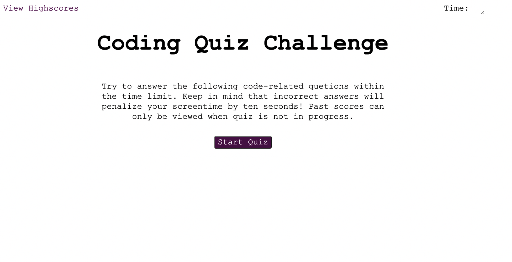

# Coding Quiz

## Description

> This is coding quiz application 

## Table of Contents

- [Installation](#Installation)
- [Usage](#Usage)
- [Contributing](#Contributing)
- [Tests](#Tests)
- [Questions](#Questions)
- [License](#License)

## Installation

Install instruction step 1
```
sh installOne.sh
```
Install Instruction step 2
```
sh installSecond.sh
```

## Usage

> Usage Step 1 
 
> Usage Step 2 
 

## Contributing

> Please follow below link for contribution guidelines. 

 


## Tests

> Test Step 1 
> Test Step 2 
> Test Step 3 

## Questions

> Q1. What is my link to my github profile ? 
Answer: [Github Username](https://github.com/SanjeevKumar-DEV) 

> Q2. How to reach me with additional questions ? 
Answer: [Contact Email](mailto:sanjeevkumar@me.com)

## License

> This application is covered under Boost license agreement.
