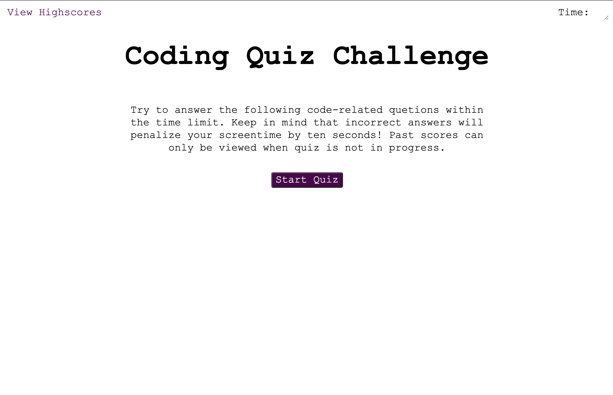
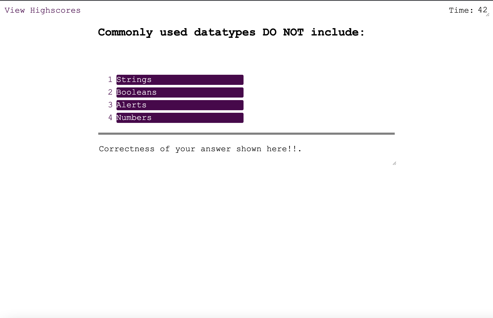
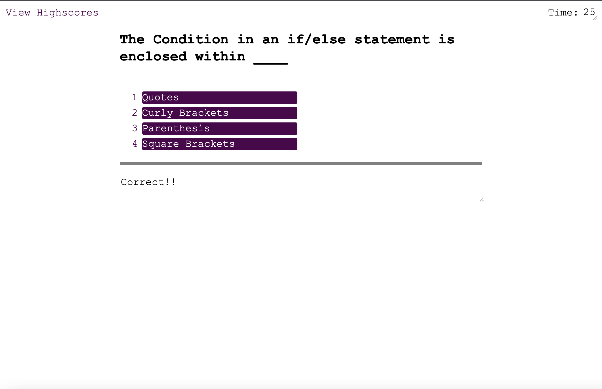
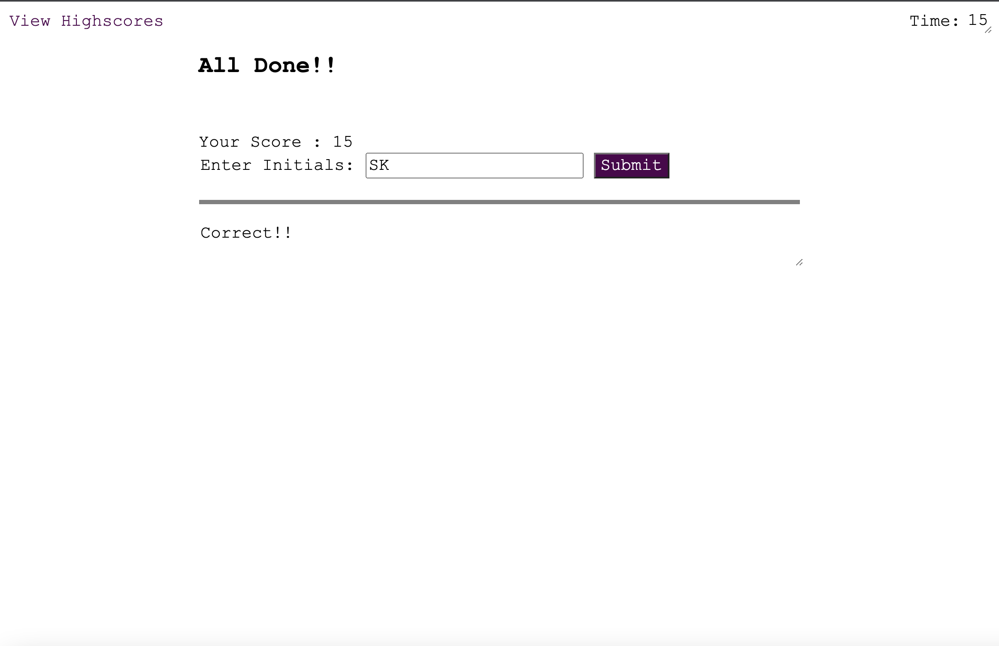
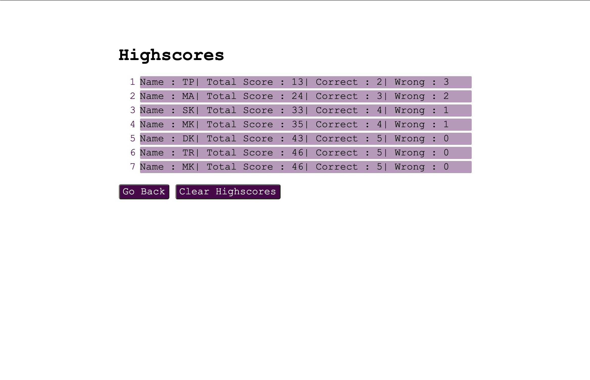

# Timing Coding Quiz

[Application URL  ](https://sanjeevkumar-dev.github.io/Timing-Coding-Quiz/)
[Repository URL ](https://github.com/SanjeevKumar-DEV/Timing-Coding-Quiz)

## Description

> This application provides timing coding quiz 
> with multiple choice questions. You can view 
> the stats of the quiz at end of the quiz or 
> from top link "View Highscores" if quiz is 
> not in progress. Once quiz finish, you can 
> add your score to the existing tally. Your 
> evaluated answers for previous question is 
> displayed at the bottom of the screen. At 
> the end of the quiz you can see your total 
> score. You loose 10 points for each wrong 
> answers. 

## Table of Contents

- [Installation](#Installation)
- [Usage](#Usage)
- [Contributing](#Contributing)
- [Tests](#Tests)
- [Questions](#Questions)
- [License](#License)

## Installation

Clone the repository using the repository URL as mentioned below.
```
Git clone git@github.com:SanjeevKumar-DEV/Timing-Coding-Quiz.git 
```
Open Terminal and go to cloned repository location and fire code editor
```
code . 
```

## Usage

> Start the quiz by Pressing Start Quiz button 
 
> Answer the question 1 by selecting write answer from multiple choices. 
 
> Answer the question 2 by selecting write answer from multiple choices and all the rest of the subsequent questions one after another. 
 
> Once you reach quiz completed screen. Submit your initials. 
 
> Now you can view the stats and also clear the scores or start the quiz again. 
 

## Contributing

> Contribution guidelines development is in progress. 

 


## Tests

> Test Development strategy is in progress. 

## Questions

> Q1. What is my link to my github profile ? 
Answer: [Github Username](https://github.com/SanjeevKumar-DEV) 

> Q2. How to reach me with additional questions ? 
Answer: [Contact Email](mailto:sanjeevkumar@me.com)

## License

> License agreement is covered under guidelines and agreement of GitHub and Microsoft.
