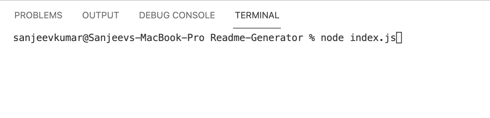
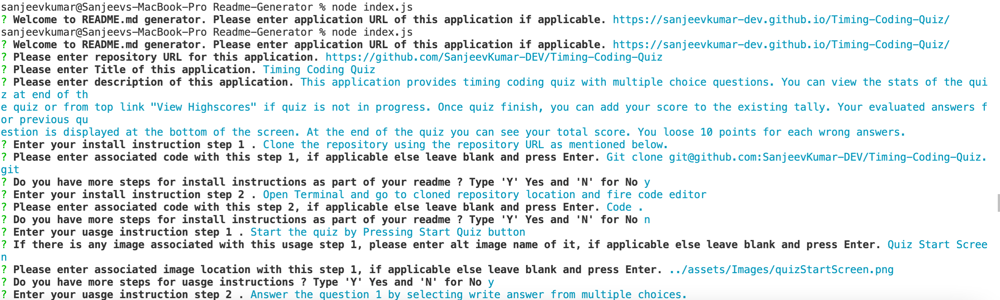

# README Generator

[Application Video URL 1  ](https://drive.google.com/file/d/1jPwBuRB2FDgLHR9P9UpDvUee3XBwPRly/view)
[Application Video URL 1  ](https://drive.google.com/file/d/1Q1-dKIY6HLKycwmEJbT96oecwu50dC0m/view)
[Repository URL ](https://github.com/SanjeevKumar-DEV/Readme-Generator)

## Description

> This is a command line application that 
> generates nicely formatted README.md file 
> based upon user inputs. 

## Table of Contents

- [Installation](#Installation)
- [Usage](#Usage)
- [Contributing](#Contributing)
- [Tests](#Tests)
- [Questions](#Questions)
- [License](#License)

## Installation

Clone the repository using the repository URL as mentioned below.
```
Git clone git@github.com:SanjeevKumar-DEV/Readme-Generator.git
```
Open Terminal and go to cloned repository location and fire code editor
```
code .
```
Open Terminal and install the node modules.
```
npm install
```

## Usage

> Start terminal and invoke application by typing ‘node index.js’  
 
> Answer all the questions as applicable one after another about repository, title of the project, Description, Installation, Usage, License, Contributing, Tests, Questions, Github profile and Email 
 

## Contributing

> Not Applicable 

## Tests

> Not Applicable 

## Questions

> Q1. What is my link to my github profile ? 
Answer: [Github Username](https://github.com/SanjeevKumar-DEV) 

> Q2. How to reach me with additional questions ? 
Answer: [Contact Email](mailto:sanjeevkumar@me.com)

## License

> License agreement is covered under EULA with Github
